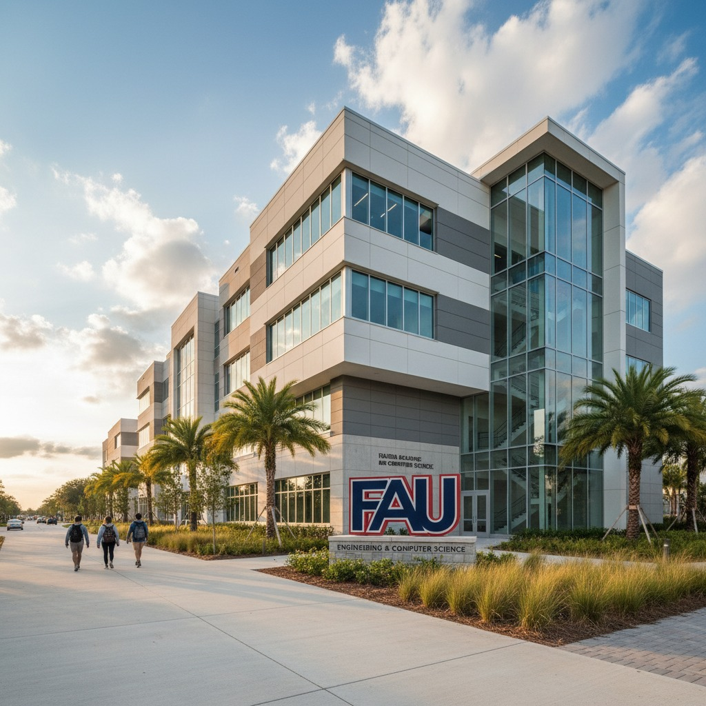

# Mohammad Shehroz Ashraf & Sher Ali
# FAU
# Project: Image2Image + Text2Image Video Generation for FAU Engineering

# Progress Summary

We worked on this project over four weeks, starting with text-to-image generation using Stable Diffusion and Gemini. Although the models created interesting visuals, most results were too abstract and did not match the real FAU Engineering environment. Because of this, we briefly tried NanoBanana for text-to-image, but the figures were still inconsistent.

To improve realism, we then moved to image-to-image and finally image-to-video generation. We used RIO-3 (Veo 3.1) to animate real FAU images, which produced smooth and realistic motion that worked much better for a promotional-style video.

# Dataset
Our dataset includes real images taken around:
  1. FAU Engineering & Computer Science Building
  2. Labs and research spaces
  3. Hallways, library areas, and study spots
  4. Student collaboration photos
  5. Palm trees, Boca Raton scenery, and campus surroundings

These images served as inputs for the image-to-video pipeline.

# Examples

## Text-to-Image Example:
Prompt: “Student working in an engineering lab at FAU with bright lighting.”
Result: Abstract, unrealistic figures → not usable.

## Image-to-Video Example:
Prompt: “Cinematic slow push-in toward the FAU Engineering building.”
Result: Smooth 8-second clip with natural motion → final method used.
[Watch Test Video](Test_Video_1.mp4)

# Final Approach
After testing several methods, we concluded that image-to-video generation produces the most reliable and realistic output. Our final pipeline uses real FAU photos enhanced with AI-generated movement to create short cinematic videos representing FAU Engineering.
